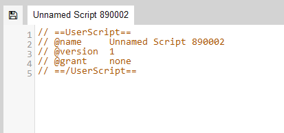

# Enchantment Summary

## Requirements
This script requires a userscript addon, so please pick and install one of the options listed below based on your browser of choice
- Microsoft Edge : [Tampermonkey](https://microsoftedge.microsoft.com/addons/detail/tampermonkey/iikmkjmpaadaobahmlepeloendndfphd)
- Google Chrome : [Tampermonkey](https://chrome.google.com/webstore/detail/tampermonkey/dhdgffkkebhmkfjojejmpbldmpobfkfo)
- Mozilla Firefox : [Tampermonkey](https://addons.mozilla.org/en-US/firefox/addon/tampermonkey/) or [Greasemonkey](https://addons.mozilla.org/en-US/firefox/addon/greasemonkey/)
- Opera : [Tampermonkey](https://addons.opera.com/en/extensions/details/tampermonkey-beta/)

## Installation
### Getting the script

- Find and click the `latest release` to the right of this documentation to be taken to the releases page

- From the `Assets` section, click the first link titled `enchant_summary.js` to download the userscript file

- When prompted select `Open` and pick any text editor available when asked
- Keep this open in the background for now and proceede to the `extension` section below

### Tampermonkey
- Find and click your new `extension` button on the browser toolbar, then pick  `Create a new script..` to launch the built in editor

- From here please replace the boilerplate code in the `editor` with the userscript you downloaded previously
- Then from the `File` menu above select `Save` or press `CTRL + S`

- If everything went to plan you should be met with a screen similar to this
- If you're already in game at this point you'll have to `refresh` once, otherwise the script will run on your next log-in

### Greasemonkey

- Find and click your new `extension` button on the browser toolbar, then pick  `New user script..` to launch the built in editor

- From here please replace the boilerplate code in the `editor` with the userscript you downloaded previously
- Then click the little `floppy-disk icon` above the `editor` or press `CTRL + S`

- The title to the right of the save icon should update to indicate that greasemonkey has accepted the change
- From here you can close the `editor` tab and if you're already in-game, `refresh` to run the script

